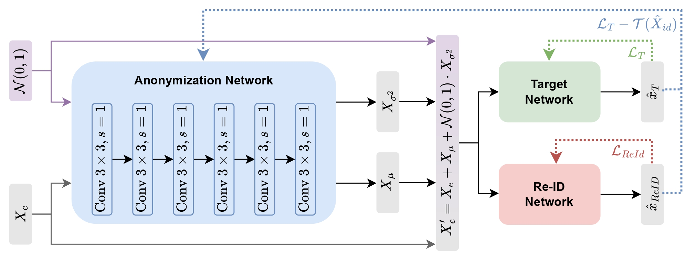

# AnonyNoise: Anonymizing Event Data with Smart Noise to Outsmart Re-Identification and Preserve Privacy (WACV25)

All good in this is from Allah swt and all mistakes are from me or Shaytan.

<p align="center">
  
</p>


```bibtex
@InProceedings{bendig2025anonynoise,
  author  = {Bendig, Katharina and Schuster, Ren{\'e} and Thiemer, Nicole and Joisten, Karen and Stricker, Didier},
  title   = {AnonyNoise: Anonymizing Event Data with Smart Noise to Outsmart Re-Identification and Preserve Privacy},
  booktitle = {Workshop on Applications of Computer Vision (WACV)},
  year    = {2025},
}
```

## Setup
Install the required dependencies using
```
pip install -r requirements.txt
```

You can download the pretrained weights for DVS-Gesture [here](https://cloud.dfki.de/owncloud/index.php/s/zqoXSwapgwLZ2YQ).

## Data

This project uses the following datasets for training and evaluation. Please ensure to download the datasets into `./data` and structure them as specified. Preprocessing is required for certain datasets as outlined below.

### DVS-Gesture
- you can download the dataset via the tonic library
```
import tonic 
tonic.datasets.DVSGesture(save_to= './data', train = True)
tonic.datasets.DVSGesture(save_to= './data', train = False)
```
- Expected Structure:
``` 
data/DVSGesture/
├── ibmGestureTrain/
│   ├── user24_flurescent/
│       ├── 0.npy
│       ├── 1.npy
├── ibmGestureTest/
│   ├── user01_flurescent/
│       ├── 0.npy
│       ├── 1.npy
```

### SEE
- [Download Link](https://onedrive.live.com/?authkey=%21ANIxtntffpkz3TM&id=C69F91E7EE2ADA21%21106&cid=C69F91E7EE2ADA21)
- [Download Link 2](http://www.dluticcd.com)
- Expected Structure:
``` 
data/SEE/event/
├── angry/
│   ├── 1_001_man_24_Master_normal_angry_45_take000/
│       ├── 00000.jpg
│       ├── 00001.jpg
├── disgust/
│   ├── 7_001_man_24_Master_normal_disgust_44_take001/
│       ├── 00000.jpg
│       ├── 00001.jpg

```

### EventReIDv2
- [Download Link](https://zenodo.org/records/8256439)
- Preprocessing: you can use the following commands for the preprocessing of data (adapted from [ReID without Id](https://github.com/IIT-PAVIS/ReId_without_Id/tree/main/data))
```
python ./reid_utils/event_partition.py --input_dir ./Event_ReId_v2/
python ./reid_utils/split_train_test.py  --data_dir ./output/Event_ReId_v2/
```

- Expected Structure:
``` 
data/EventReID_v2/
├── test/
│   ├── 002_c1_001.txt
│   ├── 002_c1_006.txt
├── train/
│   ├── 001_c1_001.txt
│   ├── 001_c1_002.txt

```

## Training

### Pretrain Networks
The following comand can be used for pre-training the Re-ID and Target network before the pipeline training. 
*Note*: The EventReIDv2 does only contain Re-ID labels and no target ground truth. 
```
DATASETPATH=./data/DVSGesture

python preposttrain_networks.py --ename dvsg_pretrain_target \
    --dataset dvsg --network resnet50 --store_weight --dataset_path ${DATASETPATH} \
    --batch_size 32 --lr0 1e-4 --epochs 200 --anno_type target

python preposttrain_networks.py --ename dvsg_pretrain_id \
    --dataset dvsg --network resnet50 --store_weight --dataset_path ${DATASETPATH} \
    --batch_size 32 --lr0 1e-4 --epochs 200 --anno_type id
```

### Pipeline Training
The following command starts the training of the pipeline. Update `BEST_TARGET_WEIGHTS` and `BEST_ID_WEIGHTS` with the paths to the weights of the best performing model from the pre-training step.
```
BEST_TARGET_WEIGHTS=???
BEST_ID_WEIGHTS=???

python train_pipeline.py --ename dvsg_pipeline \
     --dataset dvsg --network resnet50 --store_weight --dataset_path ${DATASETPATH} \
     --batch_size 32 --lr0 5e-4 --lr0_helper 1e-3 --epochs 300 \
     --target_weights ${BEST_TARGET_WEIGHTS} \
     --id_weights ${BEST_ID_WEIGHTS}

```

### Post Training w/o denoise net 
In order to post train the ReID and TargetNetwork based on the anonymized events, the following commands can be used. 
Update `AFTERPIPE_TARGET_WEIGHTS`,`AFTERPIPE_ID_WEIGHTS` and `AFTERPIPE_ANON_WEIGHTS` with the weights of the last epoch of the pipeline training. Since the anonymization network is trained in an adversarial manner only the last epoch includes the optimal results. 

```
AFTERPIPE_TARGET_WEIGHTS=???
AFTERPIPE_ID_WEIGHTS=???
AFTERPIPE_ANON_WEIGHTS=???

python preposttrain_networks.py --ename dvsg_postpipe_nodn_id \
    --dataset dvsg --network resnet50 --store_weight \
    --batch_size 32 --lr0 1e-4 --epochs 200 --anno_type id \
    --prepostmode post \
    --anon_weights ${AFTERPIPE_ANON_WEIGHTS} \
    --class_weights ${AFTERPIPE_ID_WEIGHTS}

python preposttrain_networks.py --ename dvsg_postpipe_nodn_target \
    --dataset dvsg --network resnet50 --store_weight \
    --batch_size 32 --lr0 1e-4 --epochs 200 --anno_type target \
    --prepostmode post \
    --anon_weights ${AFTERPIPE_ANON_WEIGHTS} \
    --class_weights ${AFTERPIPE_TARGET_WEIGHTS}
```
### Post Training with denoise net 
The following includes the commands for the post training inlcuding a denoise network. 
```
python preposttrain_networks.py --ename NEW_dvsg_postpipe_wdn_id \
    --dataset dvsg --network resnet50 --store_weight \
    --batch_size 32 --lr0 1e-4 --epochs 200 --anno_type id \
    --prepostmode post --denoisenet \
    --anon_weights ${AFTERPIPE_ANON_WEIGHTS}  \
    --class_weights ${AFTERPIPE_ID_WEIGHTS} 

python preposttrain_networks.py --ename NEW_dvsg_postpipe_wdn_target \
    --dataset dvsg --network resnet50 --store_weight \
    --batch_size 32 --lr0 1e-4 --epochs 200 --anno_type target \
    --prepostmode post --denoisenet \
    --anon_weights ${AFTERPIPE_ANON_WEIGHTS}  \
    --class_weights ${AFTERPIPE_TARGET_WEIGHTS}

``` 

## Evaluation 
You can evaluate any ReId or Target Network using the following command:
```
ClASS_WEIGHTS=???
python preposttrain_networks.py --ename dvsg_pretrain_target \
    --dataset dvsg --network resnet50 --dataset_path ${DATASETPATH} \
    --anno_type target --val_only --class_weights ${ClASS_WEIGHTS}
```

## Code Acknowledgements 

Our projects partially uses code from the following projects:
- **ReID without Id** ([PDF](https://arxiv.org/abs/2308.04402), [GIT](https://github.com/IIT-PAVIS/ReId_without_Id)) for the ClassNet definition and re-identification training
